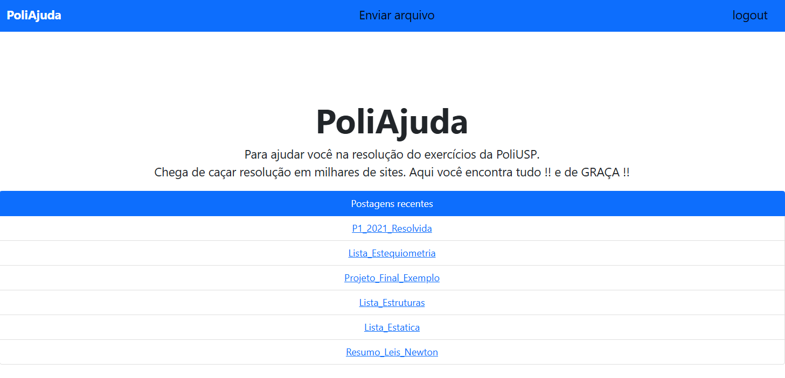
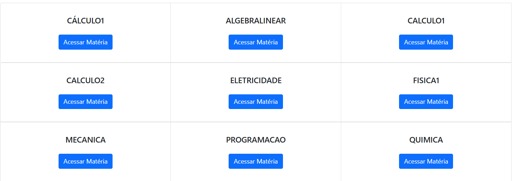

# 📚 PoliAjuda


> ⚠️ **Este é um projeto POC (Proof of Concept)**, criado para estudo e prática do framework Django. Não representa uma aplicação pronta para produção — faltam validações, testes e configurações de segurança que um ambiente real exigiria.

**PoliAjuda** é uma plataforma web colaborativa, feita por e para alunos da Poli-USP, para compartilhar resoluções de listas, provas e resumos organizados por matéria. Chega de caçar resolução espalhada em mil sites diferentes — aqui é tudo num só lugar, e de graça.

---

## 📸 Demonstração

| Página inicial | Matérias disponíveis |
| :---: | :---: |
|  |  |

---

## ✨ Funcionalidades

- 📂 **Repositório por matéria** — os documentos são agrupados automaticamente pela matéria informada no envio.
- ⬆️ **Upload de arquivos** — usuários autenticados podem enviar novos documentos (listas, provas resolvidas, resumos etc).
- 🕒 **Postagens recentes** — a página inicial destaca os últimos arquivos enviados.
- 🔐 **Login simples** — área de envio protegida por autenticação (`django.contrib.auth`).
- 🗂️ **Organização automática** — os arquivos são salvos em `media/documents/<MATERIA>/<ano>/`.

## 🛠️ Tecnologias

- **Backend:** [Django](https://www.djangoproject.com/)
- **Frontend:** HTML + [Bootstrap 5](https://getbootstrap.com/)
- **Banco de dados:** SQLite (padrão de desenvolvimento)

## 📁 Estrutura do projeto

```
PoliAjuda/
├── Arpa/                  # Configuração do projeto Django (settings, urls, wsgi)
├── website/               # App principal
│   ├── models.py          # Modelo Document
│   ├── views.py           # Views: menu, upload, login/logout, página de matéria
│   ├── forms.py           # DocumentForm e LoginForm
│   ├── templates/         # Templates HTML (base, index, upload, login, matéria)
│   └── migrations/
├── media/                 # Arquivos enviados pelos usuários (gerado em runtime)
├── db.sqlite3             # Banco de dados de desenvolvimento
└── manage.py
```

## 🚀 Como rodar localmente

**Pré-requisitos:** Python 3.8+ instalado.

```bash
# 1. Clone o repositório
git clone https://github.com/Eduds007/PoliAjuda.git
cd PoliAjuda

# 2. Crie e ative um ambiente virtual
python -m venv venv
venv\Scripts\activate      # Windows
# source venv/bin/activate # Linux/macOS

# 3. Instale as dependências
pip install -r requirements.txt

# 4. Aplique as migrações
python manage.py migrate

# 5. (Opcional) Crie um usuário para acessar a área de upload
python manage.py createsuperuser

# 6. Rode o servidor
python manage.py runserver
```

O site estará disponível em `http://127.0.0.1:8000/`.

> O banco `db.sqlite3` já vem com documentos de exemplo cadastrados em diversas matérias (Cálculo 1 e 2, Física 1, Química, Álgebra Linear, Programação, Mecânica e Eletricidade), prontos para explorar a navegação por matéria sem precisar subir arquivos manualmente.

## 🤝 Contribuindo

Sugestões e melhorias são bem-vindas! Sinta-se à vontade para abrir uma *issue* ou *pull request*.

## 📄 Licença

Este projeto está sob a licença MIT.

---

Feito com 💙 por [Eduardo Milanez Araujo](mailto:edu.milanez@usp.br) para a comunidade da Poli-USP.
